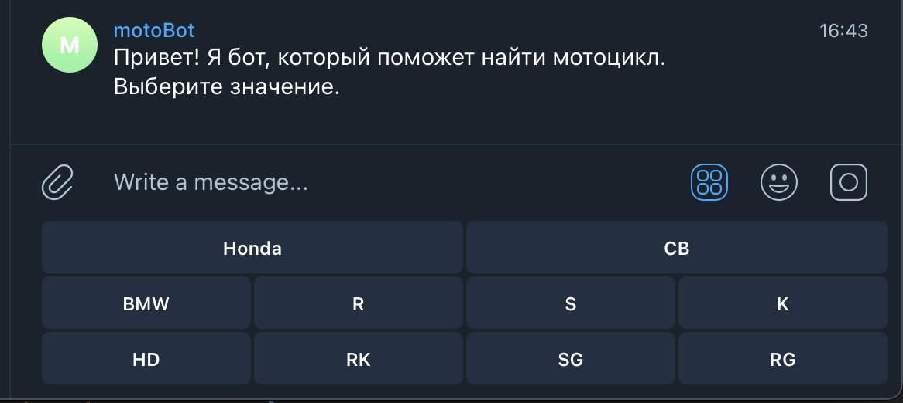
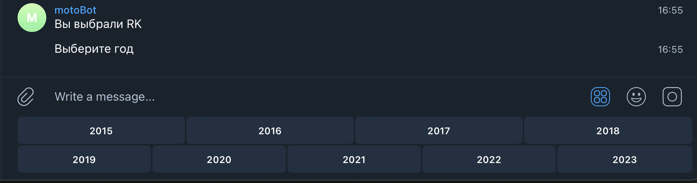
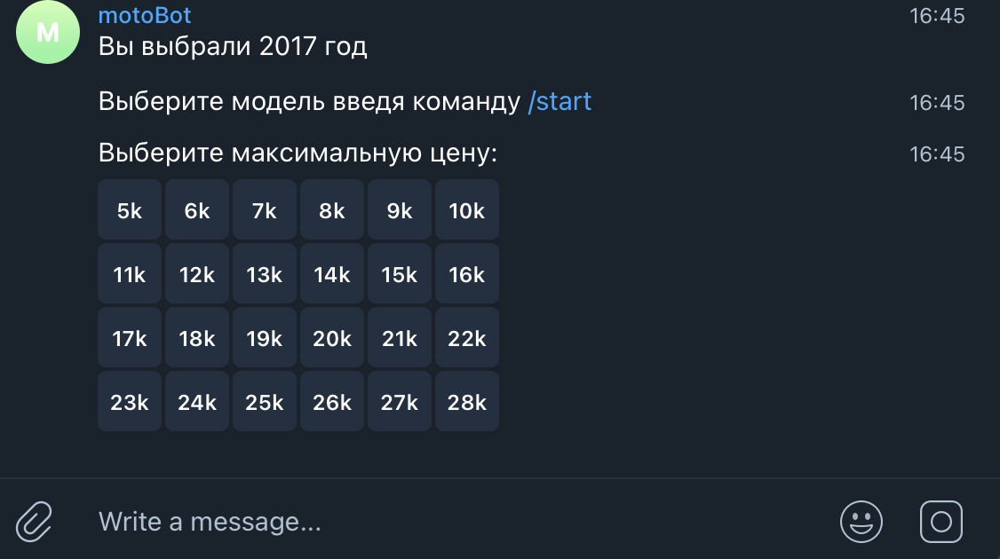
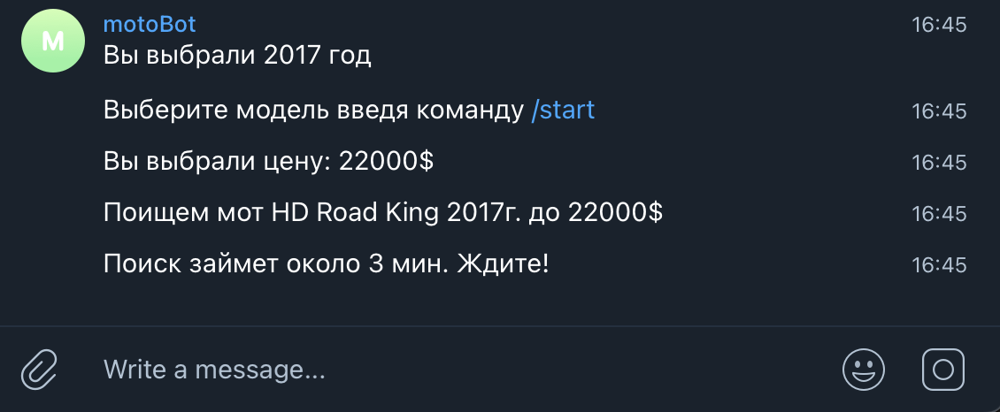

# Telegram tgMotoBot

Telegram tgMotoBot is a JavaScript-based Telegram bot designed to scrape the https://moto.av.by website and deliver information about available motorcycle listings directly to your Telegram account. This README provides a comprehensive guide to the project, detailing its functionality and offering instructions for easy setup and execution.

## Functionality

The Telegram tgMotoBot boasts the following key features:

1. **Select Motorcycle Specifications**: This feature allows users to choose the brand and model of the motorcycle, specify the year, and set a desired price range.

2. **Search for Listings**: Once the specifications are set, the bot initiates a search and sends the links to the discovered motorcycle listings directly to your Telegram.

## Prerequisites

Before running the Telegram tgMotoBot, ensure you have the following dependencies installed:

- Node.js
- npm (Node Package Manager)
- Telegram API token

## Installation

```bash
git clone [your path to repo]
cd tgMotoBot
npm install
node index.js
```

## Usage

Obtain a Telegram API token by creating a new bot on BotFather.
Create a .env file in the project directory and add your Telegram API token.

Open your Telegram and start interacting with the tgMotoBot by following the prompts.

## Contributing

If you'd like to contribute to the project, please follow these steps:

Fork the repository.
Create a new branch for your feature or bug fix.
Make your changes and commit them with descriptive messages.
Push your changes to your fork.
Open a pull request to the original repository.





